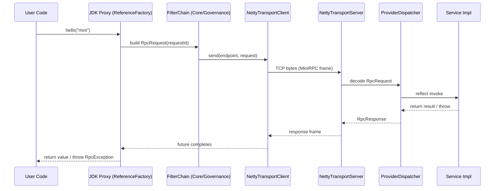

# MiniRPC

[中文说明](README_CN.md)

MiniRPC is a **Dubbo-lite** RPC framework built for **learning + showcasing engineering ability**: you can follow the whole
call path end-to-end (proxy → codec → transport → dispatch), while keeping the design modular and extensible.

- **JDK**: 21 (Virtual Threads)
- **Transport**: Netty TCP long connection
- **Protocol**: custom binary framing (fixed 22B header + extensible header + body)
- **Extensibility**: Java SPI (`ServiceLoader`) for pluggable components

> ⚠️ This project is **NOT** a production-ready RPC solution (no TLS/auth, minimal governance).  
> It is designed for **understanding RPC fundamentals** and as a **readable portfolio project**.

---

## What’s implemented (E1 / Beta)

✅ **Binary framing protocol**
- Big-endian, fixed header 22 bytes
- Extensible header supported (currently unused, `headerLen = 0` in E1)
- Sticky/half packet handled via Netty frame slicing

✅ **Netty transport**
- Client/Server request-response over TCP
- `requestId -> CompletableFuture` in-flight correlation
- Provider business logic runs on **Java 21 virtual threads** (IO threads do not execute business)

✅ **Serialization (SPI)**
- JSON serializer (`serializeType = 0`) via `ServiceLoader`

✅ **Core call chain**
- Consumer: JDK dynamic proxy builds `RpcRequest`
- Provider: reflection-based dispatcher invokes target method
- Runnable examples: Provider & Consumer

✅ **Tests**
- Protocol parsing & validation
- Netty frame slicing (half/sticky packets)
- Transport integration test
- End-to-end proxy test

---

## Roadmap (next milestones)

- **E2 Governance**
  - Timeout (client side)
  - Retry (max once, only for retryable failures)
  - TraceId injection + structured logging (Filter chain)
- **E3 Registry + LoadBalancer**
  - Redis registry (TTL + renewal + Pub/Sub notifications)
  - Client-side LoadBalancer (Random / RoundRobin) via SPI
- **E4 Heartbeat + resilience**
  - Heartbeat frame (`flags.heartbeat`)
  - Reconnect strategy + fail-fast inflight on channel inactive

Progress tracking:
- `docs/progress_log.md`
- `docs/steps_checklist.md`

---

## Quick Start

### Requirements
- JDK 21
- Maven 3.8+

### Build examples
```bash
mvn -pl minirpc-example-provider,minirpc-example-consumer -am package
```

### Run (IDE)
- Provider: `top.ainexur.minirpc.example.provider.Main` (args: `port`, default `8080`)
- Consumer: `top.ainexur.minirpc.example.consumer.Main` (args: `host port`, default `127.0.0.1 8080`)

Start Provider first, then run Consumer to see a request/response round-trip.

### Run (CLI, no exec plugin required)
```bash
mvn -pl minirpc-example-provider -am -DskipTests package dependency:copy-dependencies
java -cp "minirpc-example-provider/target/classes:minirpc-example-provider/target/dependency/*" \
  top.ainexur.minirpc.example.provider.Main 8080
```

```bash
mvn -pl minirpc-example-consumer -am -DskipTests package dependency:copy-dependencies
java -cp "minirpc-example-consumer/target/classes:minirpc-example-consumer/target/dependency/*" \
  top.ainexur.minirpc.example.consumer.Main 127.0.0.1 8080
```

> Windows: replace `:` with `;` in the `-cp` classpath.

---

## Architecture (call flow)



Key design points (the “why”):
- **Framing is explicit**: fixed header contains lengths, so Netty can safely slice frames (no delimiter ambiguity).
- **RequestId is the correlation key**: async transport becomes simple (`Map<requestId, future>`).
- **IO & business separation**: Netty event loops focus on read/write, business runs on virtual threads → avoids blocking IO threads.

---

## Protocol (binary framing)

Frame layout (big-endian integers):

```text
+---------------------------+
| Fixed Header              | 22 bytes
+---------------------------+
| Extensible Header         | headerLen bytes (may be 0)
+---------------------------+
| Body                      | bodyLen bytes (may be 0)
+---------------------------+
```

### Fixed header (22 bytes)

| Field | Size | Type | Notes |
|---|---:|---|---|
| magic | 2 | short | `0xCAFE` |
| version | 1 | byte | `1` |
| serializeType | 1 | byte | `0 = JSON` (SPI extensible) |
| flags | 2 | short | bitmap (heartbeat/compress/encrypt/oneway/response) |
| requestId | 8 | long | correlates request/response |
| headerLen | 4 | int | length of extensible header |
| bodyLen | 4 | int | length of body bytes |

### Flags (16-bit bitmap)

| Bit | Name | Meaning |
|---:|---|---|
| 0 | HEARTBEAT | heartbeat frame |
| 1 | COMPRESSED | body is compressed (reserved) |
| 2 | ENCRYPTED | body is encrypted (reserved) |
| 3 | ONE_WAY | one-way request (reserved) |
| 4 | RESPONSE | `1 = response`, `0 = request` |

### Implementation mapping

- Protocol parsing/encoding (Netty-free):
  - `minirpc-protocol`: `FrameParser`, `FrameEncoder`, `MiniRpcFrame`
- Netty frame slicing:
  - `minirpc-transport-netty`: `NettyFrameSlicer`
- Message mapping:
  - `DefaultMessageCodec` encodes/decodes `RpcRequest` / `RpcResponse` using `SerializerRegistry`

---

## Modules

| Module | Purpose | Status |
|---|---|---|
| `minirpc-common` | shared error codes, flag bits | ✅ |
| `minirpc-protocol` | binary frame + message codec (Netty-free) | ✅ |
| `minirpc-serialization` | serializer SPI + JSON impl | ✅ |
| `minirpc-transport-netty` | Netty client/server + slicing | ✅ |
| `minirpc-core` | exporter/dispatcher/proxy + filter chain skeleton | ✅ |
| `minirpc-governance` | timeout/retry/trace/log filters | ⏳ (stub) |
| `minirpc-registry-redis` | Redis registry (TTL + Pub/Sub) | ⏳ (stub) |
| `minirpc-loadbalancer` | LB strategies (Random/RR) via SPI | ⏳ (stub) |
| `minirpc-example-provider` | runnable provider demo | ✅ |
| `minirpc-example-consumer` | runnable consumer demo | ✅ |
| `minirpc-poc` | experiments (reserved) | 🧪 (currently empty) |

---

## Testing

Run all tests:
```bash
mvn test
```

Run a single module:
```bash
mvn -pl minirpc-protocol test
mvn -pl minirpc-transport-netty test
mvn -pl minirpc-core test
```

---

## Documentation

- `docs/progress_log.md`: development log and decisions
- `docs/steps_checklist.md`: milestone checklist (E0–E4)
- `docs/chatgpt/`: design baseline (requirement freeze, protocol spec, architecture, PoC notes)

---

## Contributing

- Keep module boundaries clean (do not introduce “up-layer” dependencies).
- Add tests when behavior changes.
- Prefer small PRs aligned with milestones (E2/E3/E4).

---

## License

No license yet. Intended for learning and internal use only.