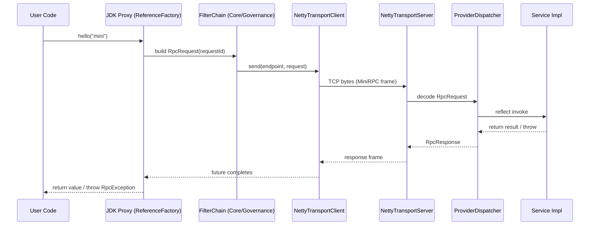

# MiniRPC

MiniRPC 是一个 **Dubbo-lite** 的 RPC 框架，用于 **学习与工程能力展示**：可以清晰地跟踪端到端调用链路（proxy → codec → transport → dispatch），同时保持设计的模块化与可扩展性。

- **JDK**：21（Virtual Threads）
- **Transport**：Netty TCP 长连接
- **Protocol**：自定义二进制分帧（固定 22B 头 + 可扩展头 + body）
- **Extensibility**：Java SPI（`ServiceLoader`）可插拔组件

> ⚠️ 本项目**不是**生产级 RPC 方案（无 TLS/鉴权，治理能力最小化）。  
> 主要用于**理解 RPC 基础**与**可读的作品集项目**。

---

## 已实现内容（E1 / Beta）

✅ **二进制分帧协议**
- 大端序，固定头 22 字节
- 支持可扩展头（E1 中 `headerLen = 0`）
- Netty 切帧处理粘包/半包

✅ **Netty 传输**
- Client/Server 通过 TCP 完成请求-响应
- `requestId -> CompletableFuture` 做 in-flight 关联
- Provider 业务逻辑运行在 **Java 21 虚拟线程**（IO 线程不执行业务）

✅ **序列化（SPI）**
- JSON 序列化（`serializeType = 0`）通过 `ServiceLoader`

✅ **核心调用链**
- Consumer：JDK 动态代理构建 `RpcRequest`
- Provider：反射式 dispatcher 调用目标方法
- 可运行示例：Provider & Consumer

✅ **测试**
- 协议解析与校验
- Netty 切帧（半包/粘包）
- 传输集成测试
- 端到端代理测试

---

## Roadmap（下一阶段）

- **E2 Governance**
  - 超时（客户端）
  - 重试（最多一次，仅对可重试失败）
  - TraceId 注入 + 结构化日志（Filter 链）
- **E3 Registry + LoadBalancer**
  - Redis 注册中心（TTL + 续约 + Pub/Sub 通知）
  - 客户端负载均衡（Random / RoundRobin）SPI
- **E4 Heartbeat + resilience**
  - 心跳帧（`flags.heartbeat`）
  - 重连策略 + channel 失活时 inflight 快速失败

进度跟踪：
- `docs/progress_log.md`
- `docs/steps_checklist.md`

---

## 快速开始

### 环境要求
- JDK 21
- Maven 3.8+

### 构建示例
```bash
mvn -pl minirpc-example-provider,minirpc-example-consumer -am package
```

### 运行（IDE）
- Provider：`top.ainexur.minirpc.example.provider.Main`（参数：`port`，默认 `8080`）
- Consumer：`top.ainexur.minirpc.example.consumer.Main`（参数：`host port`，默认 `127.0.0.1 8080`）

先启动 Provider，再运行 Consumer 即可看到请求/响应闭环。

### 运行（CLI，无需 exec 插件）
```bash
mvn -pl minirpc-example-provider -am -DskipTests package dependency:copy-dependencies
java -cp "minirpc-example-provider/target/classes:minirpc-example-provider/target/dependency/*" \
  top.ainexur.minirpc.example.provider.Main 8080
```

```bash
mvn -pl minirpc-example-consumer -am -DskipTests package dependency:copy-dependencies
java -cp "minirpc-example-consumer/target/classes:minirpc-example-consumer/target/dependency/*" \
  top.ainexur.minirpc.example.consumer.Main 127.0.0.1 8080
```

> Windows：`-cp` 中的路径分隔符请用 `;` 替代 `:`。

---

## 架构（调用链路）



关键设计点（Why）：
- **显式分帧**：固定头记录长度，Netty 可稳定切帧，无分隔符歧义。
- **RequestId 关联**：异步传输通过 `Map<requestId, future>` 变得直接可控。
- **IO 与业务分离**：Netty event loop 只负责读写，业务运行在虚拟线程，避免阻塞 IO 线程。

---

## 协议（二进制分帧）

帧布局（大端序整数）：

```text
+---------------------------+
| Fixed Header              | 22 bytes
+---------------------------+
| Extensible Header         | headerLen bytes (may be 0)
+---------------------------+
| Body                      | bodyLen bytes (may be 0)
+---------------------------+
```

### 固定头（22 bytes）

| 字段 | 大小 | 类型 | 说明 |
|---|---:|---|---|
| magic | 2 | short | `0xCAFE` |
| version | 1 | byte | `1` |
| serializeType | 1 | byte | `0 = JSON`（SPI 可扩展） |
| flags | 2 | short | bitmap（heartbeat/compress/encrypt/oneway/response） |
| requestId | 8 | long | 关联 request/response |
| headerLen | 4 | int | 可扩展头长度 |
| bodyLen | 4 | int | body 字节长度 |

### Flags（16-bit bitmap）

| Bit | 名称 | 含义 |
|---:|---|---|
| 0 | HEARTBEAT | 心跳帧 |
| 1 | COMPRESSED | body 压缩（保留） |
| 2 | ENCRYPTED | body 加密（保留） |
| 3 | ONE_WAY | 单向请求（保留） |
| 4 | RESPONSE | `1 = response`, `0 = request` |

### 代码映射

- 协议解析/编码（Netty-free）：
  - `minirpc-protocol`：`FrameParser`、`FrameEncoder`、`MiniRpcFrame`
- Netty 切帧：
  - `minirpc-transport-netty`：`NettyFrameSlicer`
- 消息映射：
  - `DefaultMessageCodec` 使用 `SerializerRegistry` 编解码 `RpcRequest` / `RpcResponse`

---

## 模块

| 模块 | 作用 | 状态 |
|---|---|---|
| `minirpc-common` | 公共错误码、标志位 | ✅ |
| `minirpc-protocol` | 二进制帧 + 消息编解码（Netty-free） | ✅ |
| `minirpc-serialization` | 序列化 SPI + JSON 实现 | ✅ |
| `minirpc-transport-netty` | Netty 客户端/服务端 + 切帧 | ✅ |
| `minirpc-core` | exporter/dispatcher/proxy + filter 链骨架 | ✅ |
| `minirpc-governance` | 超时/重试/trace/log 过滤器 | ⏳（stub） |
| `minirpc-registry-redis` | Redis 注册中心（TTL + Pub/Sub） | ⏳（stub） |
| `minirpc-loadbalancer` | LB 策略（Random/RR）SPI | ⏳（stub） |
| `minirpc-example-provider` | 可运行 provider 示例 | ✅ |
| `minirpc-example-consumer` | 可运行 consumer 示例 | ✅ |
| `minirpc-poc` | 实验（预留） | 🧪（当前为空） |

---

## 测试

运行全部测试：
```bash
mvn test
```

运行单个模块：
```bash
mvn -pl minirpc-protocol test
mvn -pl minirpc-transport-netty test
mvn -pl minirpc-core test
```

---

## 文档

- `docs/progress_log.md`：开发记录与关键决策
- `docs/steps_checklist.md`：阶段清单（E0–E4）
- `docs/chatgpt/`：设计基线（需求冻结、协议规范、架构、PoC 记录）

---

## 贡献

- 保持模块边界清晰（不要引入“向上依赖”）。
- 行为变更请补充测试。
- 小步 PR，尽量与里程碑（E2/E3/E4）对齐。

---

## License

暂无开源许可，仅用于学习与内部使用。
